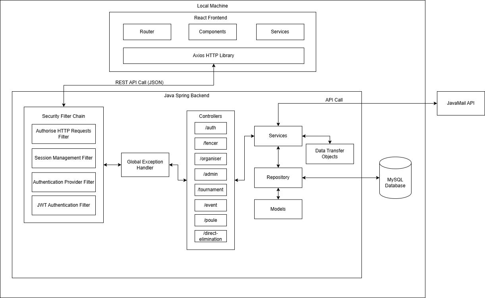
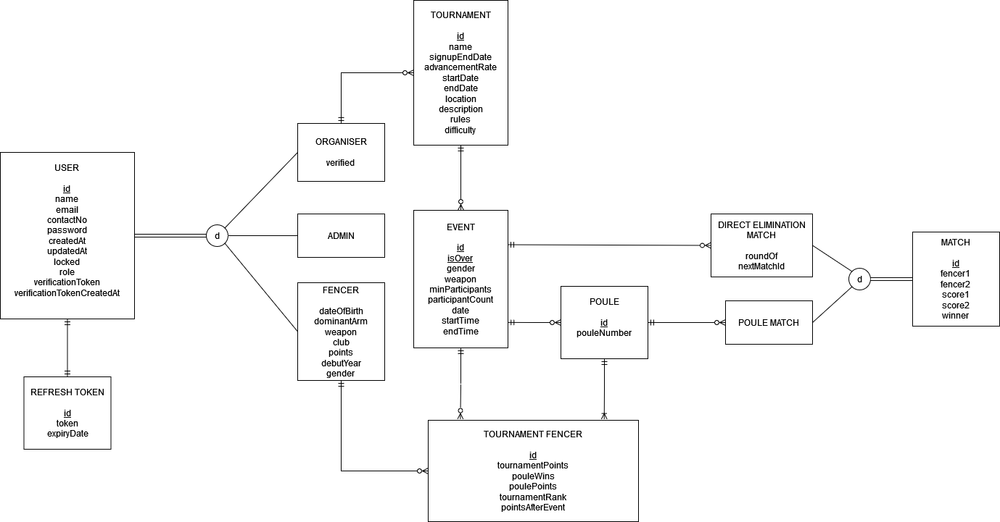
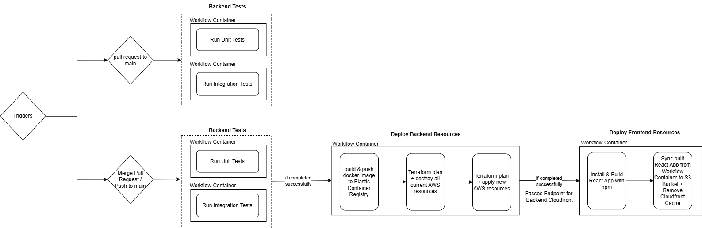
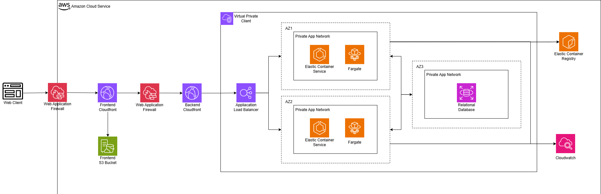

<a id="readme-top"></a>

<!-- TABLE OF CONTENTS -->
<details>
  <summary>Table of Contents</summary>
  <ul>
    <li><a href="#about-the-project">About The Project</a></li>
    <li><a href="#built-with">Built With</a></li>
    <li><a href="#features">Features</a></li>
    <li><a href="#pre-populated-data-for-testing">Pre-populated Data (For testing)</a></li>
    <li><a href="#tournament-format">Tournament Format</a></li>
    <li><a href="#diagrams">Diagrams</a></li>
    <li><a href="#directory-structure">Directory structure</a></li>
    <li><a href="#setup-and-installations">Setup and Installations</a></li>
    <li><a href="#documentation">Documentation</a></li>
  </ul>
</details>

# Fencing Tournament Management System

<!-- ABOUT THE PROJECT -->
## About The Project
A web application is designed to streamline management of fencing tournaments. The application allows for organisers to create and manage tournaments. It also allows fencers (players) to view and register for tournaments, as well as track their results and rankings after the tournaments.

<p align="right">(<a href="#readme-top">back to top</a>)</p>


## Built With
### Frontend
* [![React][react-logo]][react-url]
* [![TailwindCSS][tailwind-logo]][tailwind-url]
* [![DaisyUI][daisy-logo]][daisy-url]
* [![Framer][framer-logo]][framer-url]


### Backend
* [![Spring boot][spring boot-logo]][spring boot-url]
* [![Maven Apache][maven-logo]][maven-url]
* [![MySQL][mysql-logo]][mysql-url]

### Others
* [![AWS][aws-logo]][aws-url]
* [![Terraform][terraform-logo]][terraform-url]
* [![Docker][docker-logo]][docker-url]
* [![Github Actions][github-logo]][github-url]

<p align="right">(<a href="#readme-top">back to top</a>)</p>


## Features
### Admin
- Verify Organisers
- View all users

### Organiser
- Create and manage tournaments

### Fencer (Player)
- Register for events
- Use chatbot

### Public
- View tournaments, match results and ranking
- View fencer international ranking 
 
<p align="right">(<a href="#readme-top">back to top</a>)</p>


## Pre-populated Data (For testing)
#### Admin
  &nbsp;&nbsp;&nbsp;&nbsp;**Email:** admin1@xyz.com \
  &nbsp;&nbsp;&nbsp;&nbsp;**Password:** Abcd1234!

#### Organiser 
  &nbsp;&nbsp;&nbsp;&nbsp;**Email:** organiser1@xyz.com \
  &nbsp;&nbsp;&nbsp;&nbsp;**Password:** Abcd1234!

#### Fencer (60 fencers - 10 for each category)
  &nbsp;&nbsp;&nbsp;&nbsp;**Email:** MSfencer1@gmail.com \
  &nbsp;&nbsp;&nbsp;&nbsp;**Password:** Abcd1234!

### Tournaments and Events
  &nbsp;&nbsp;&nbsp;&nbsp;Every tournament has a Men Sabre event
  <ul>
    <li>Upcoming tournaments</li>
    <li>Ongoing tournaments (e.g. Tournament0)</li>
    <li>Past tournaments</li>
  </ul>

<p align="right">(<a href="#readme-top">back to top</a>)</p>


## Tournament Format
<ol>
  <li>Poules 
    <ul>
      <li>Fencers will be group into small poules (5-10 fencers per poule), based on their international ranking, where they compete against each other in a round-robin format.
      </li> 
      <li>Fencers will be ranked by the following</li>
        <ol>
          <li>Number of wins</li>
          <li>Number of points</li>
          <li>International Rank (higher internationally ranked fencer will be ranked lower than another fencer with same wins and points)
        </ol> 
      <li>Number of fencers that advance is based on tournament advancement rate (set by organiser)</li>
      <li>Poule points are between 0 to 5.</li> 
    </ul>
  </li>
  <li>Direct Elimination Matches 
    <ul>
      <li>If the number of fencers that advanced is not a power of 2, the lowest poule ranked fencers will fence off until a power of 2 is reached (e.g. if 20 fencers advance, 8 lowest poule ranking fencers will fence off)</li> 
      <li> Fencers are seeded into the bracket based on poule ranking. (e.g. the top-ranked fencer will face the lowest-ranked fencer, the second highest faces the second lowest, and so on)</li> 
      <li> Match points are between 0 to 15 with no ties.</li> 
    </ul>
  </li>
</ol>

<p align="right">(<a href="#readme-top">back to top</a>)</p>


## Diagrams
### Application Architecture Diagram (Local Machine)


### Database Diagram


### CI/CD Pipeline


### AWS Cloud Architecture Diagram


<p align="right">(<a href="#readme-top">back to top</a>)</p>


## Directory Structure
### Backend
```plaintext
.
├── comparator
├── controller
│   ├── admin
│   ├── authentication
│   ├── chatbot
│   ├── event
│   ├── fencer
│   ├── match
│   ├── organiser
│   └── tournament
├── datastructure
├── dto
│   ├── clean
│   ├── other
├── exception
├── model
│   ├── tournamentrelated
│   └── userrelated
├── repository
│   ├── tournamentrelated
│   └── userrelated
├── security
│   ├── config
│   ├── model
│   ├── repository
│   └── service
├── service
│   ├── admin
│   ├── authentication
│   ├── chatbot
│   ├── event
│   ├── fencer
│   ├── match
│   ├── organiser
│   └── tournament
├── validation
└── OverallApplication.java
```

### Frontend
```plaintext
.
├── Assets
├── Components
│   ├── Admin
│   ├── Authentication
│   ├── Others
│   ├── Tournament
│   ├── Chatbot
│   ├── FencerDashboard
│   ├── InternationalRanking
│   ├── Navbar
│   ├── OrganiserDashboard
│   └── Sidebar
├── Layouts
│   ├── AdminLayout
│   ├── AuthLayout
│   ├── DefaultLayout
│   └── UnauthenticatedLayout
├── Services
│   ├── Admin
│   ├── Authentication
│   ├── Chatbot
│   ├── Event
│   ├── Fencer
│   ├── Organiser
│   └── Tournament
├── App.css
├── App.js
├── App.test.js
├── Config.js
├── index.css
├── index.js
├── logo.svg
├── reportWebVitals.js
└── setupTests.js
```

<p align="right">(<a href="#readme-top">back to top</a>)</p>


## Setup and Installations
### Prerequisite
- [Docker Desktop](https://www.docker.com/products/docker-desktop/)

### Installations
1. **Clone the repo**
    ```sh
    git clone https://github.com/heapheaphoorayV3/CS203-FTMS
    ```
2. **Edit .env_template (and rename to .env) file with all the relevant environment variables. (.env not committed for security reasons)**

3. **Docker Compose**
    ```sh
    docker compose up --build
    ```

<p align="right">(<a href="#readme-top">back to top</a>)</p>


## Documentation
### To generate the javadoc documentation, run the following:

1. **Navigate to the correct directory**
  ```sh
  cd backend/overall/overall
  ```

2. **Generate and open javadoc**
<details> <summary>Windows</summary>

```sh 
mvn javadoc:javadoc && start target/site/apidocs/index.html
```
</details> <details> <summary>macOS / Linux</summary>

```sh
mvn javadoc:javadoc && open target/site/apidocs/index.html
```
</details>

<p align="right">(<a href="#readme-top">back to top</a>)</p>

<!-- MARKDOWN LINKS & IMAGES -->
<!-- Frontend -->
[react-logo]: https://img.shields.io/badge/react-%2320232a.svg?style=for-the-badge&logo=react&logoColor=%2361DAFB
[react-url]: https://react.dev/
[tailwind-logo]:https://img.shields.io/badge/tailwindcss-%2338B2AC.svg?style=for-the-badge&logo=tailwind-css&logoColor=white
[tailwind-url]: https://tailwindcss.com/
[daisy-logo]: https://img.shields.io/badge/daisyui-5A0EF8?style=for-the-badge&logo=daisyui&logoColor=white
[daisy-url]: https://daisyui.com/
[framer-logo]: https://img.shields.io/badge/Framer-black?style=for-the-badge&logo=framer&logoColor=blue
[framer-url]: https://www.framer.com/motion/
<!-- Backend -->
[spring boot-logo]: https://img.shields.io/badge/Spring_Boot-F2F4F9?style=for-the-badge&logo=spring-boot
[spring boot-url]:https://spring.io/projects/spring-boot
[maven-logo]: https://img.shields.io/badge/Apache%20Maven-C71A36?style=for-the-badge&logo=Apache%20Maven&logoColor=white
[maven-url]: https://maven.apache.org/
[mysql-logo]: https://img.shields.io/badge/mysql-4479A1.svg?style=for-the-badge&logo=mysql&logoColor=white
[mysql-url]: https://www.mysql.com/
<!-- Others -->
[aws-logo]: https://img.shields.io/badge/AWS-%23FF9900.svg?style=for-the-badge&logo=amazon-aws&logoColor=white
[aws-url]: https://aws.amazon.com/
[terraform-logo]: https://img.shields.io/badge/terraform-%235835CC.svg?style=for-the-badge&logo=terraform&logoColor=white
[terraform-url]: https://www.terraform.io/
[docker-logo]: https://img.shields.io/badge/docker-%230db7ed.svg?style=for-the-badge&logo=docker&logoColor=white
[docker-url]: https://www.docker.com/
[github-logo]: https://img.shields.io/badge/github%20actions-%232671E5.svg?style=for-the-badge&logo=githubactions&logoColor=white
[github-url]:https://github.com/features/actions 